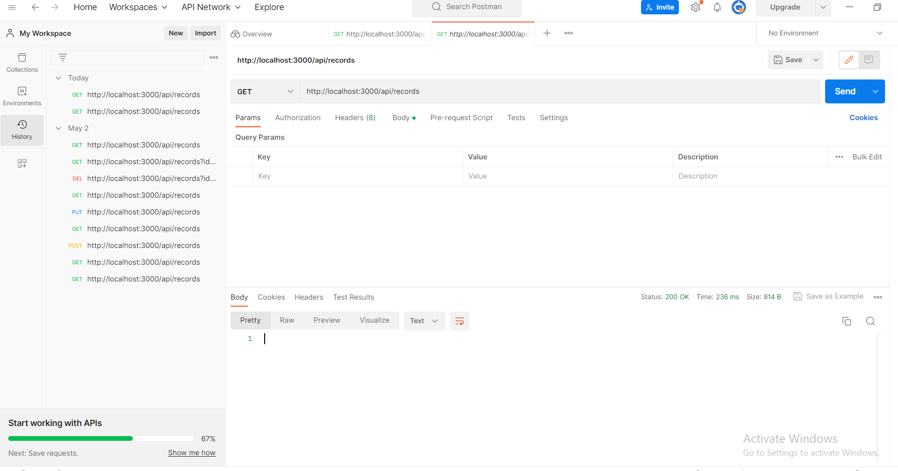
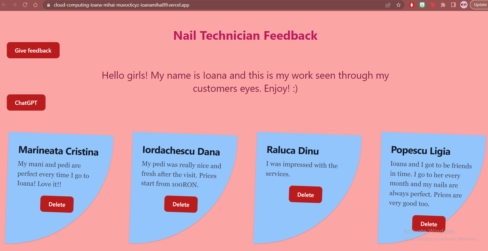
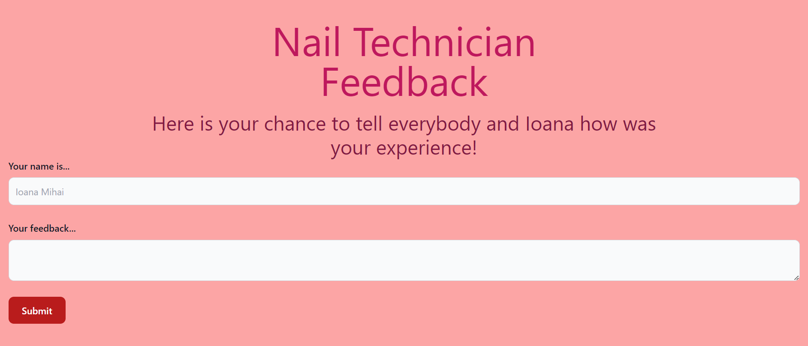
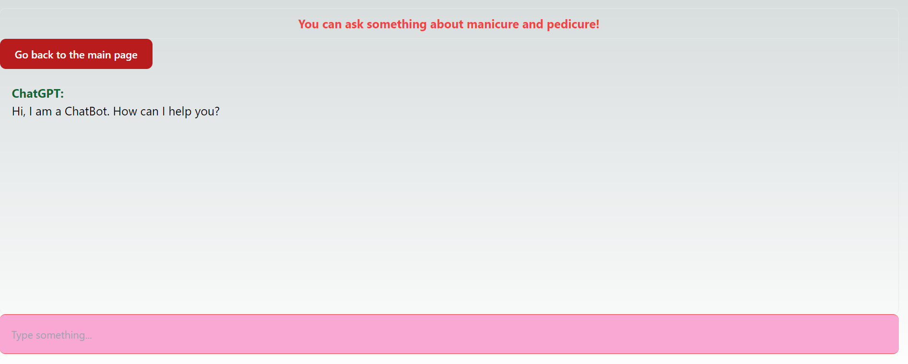

MIHAI IOANA Grupa 1120 SIMPRE

## Aplicatie Web Nail Technician

Link video: [https://youtu.be/NWAg3gz_N40](https://youtu.be/NWAg3gz_N40)
 
Link GIT: [https://github.com/ioanamihai99/cloud-computing-ioana-mihai](https://github.com/ioanamihai99/cloud-computing-ioana-mihai)
 
Link aplicatie: [https://cloud-computing-ioana-mihai-muvoc6cyz-ioanamihai99.vercel.app/](https://cloud-computing-ioana-mihai-muvoc6cyz-ioanamihai99.vercel.app/)

## Introducere

S-a realizat crearea unei aplicații web pentru a vizualiza și a acorda feedback pentru un tehnician de unghii.
Această aplicație utilizeaza 3 servicii în cloud prin intermediul unui API REST.

## Descriere problema

Există tot mai mulți tehnicieni de unghii particulari iar industria cosmetizării a luat amploare în ultimii ani.
Pentru a avea transparență și sinceritate, este necesară crearea unei aplicații în cadrul căreia să poți vizualiza dar și acorda feedback după vizitele la manichiură și pedichiură. 
 
 
Astfel, ceilalți clienți sau potențialii clienți pot vedea părerile persoanelor ce deja au experimentat o programare, prețuri și diverse alte informații.
De asemenea, includerea unui asistent inteligent într-o astfel de aplicație aduce un plus de valoare întrucât clienții pot avea curiozități referitoare la estetica unghiilor, la procesele ce se desfășoară în cadrul unei programări și cu ajutorul unui ChatGpt pot să le afle independent.

## Descriere API

•	MongoDB
 
API-ul de date MongoDB Atlas este un serviciu gestionat care vă permite să lucrați în siguranță cu datele stocate în Atlas folosind solicitări HTTPS standard. Data API nu este o conexiune directă la baza de date. În schimb, API-ul este un serviciu middleware complet gestionat, care se află între clusterul dvs. și clienții care trimit solicitări.
 
 
•	Vercel 
 
Vercel REST API le permite dezvoltatorilor să interacționeze programatic cu contul și serviciile lor Vercel folosind solicitări HTTP. Cu ajutorul API-ului, dezvoltatorii pot implementa versiuni noi de aplicații web, pot gestiona domenii personalizate, pot prelua informații despre implementări și pot gestiona secretele și variabilele de mediu pentru proiecte.
 
 
•	ChatGTP
 
Chat GPT API este un produs al Open AI, o companie specializată în cercetare și dezvoltare AI. Este un API bazat pe cloud care oferă acces la modelele de limbaj avansate ale Open AI, inclusiv GPT-3 și GPT-4

## Flux de date

 

## Capturi de ecran

 

 

